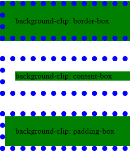

### Aula 1: Inserindo CSS na página HTML

- Externo

  - Possível de usar em mais de uma página, mais fácil de editar

  - ```html
    <link rel='stylesheet' href='estilos.css'>
    ```

- Incorporado: tag `<style>`

  - Só vale para a página

- Inline: na tag que receberá o estilo

  - ```html
    <body style="background-color: #0f0">
    ```

- Seletor:
  - `body { }`
  - Comandos na forma `propriedade: valor`

```css
body {
    background-color: #f00;
}
```

- Ordem de prioridade: inline > incorporado > externo

---

### Aula 2 - Seletores

- Seletor de tags

```css
p { color: red; }
```

- Seletor de ids: jogo da velha `#`

```css
#p1 {
	font-size: 20pt;
}
```

- Seletor de classes: ponto `.`

```css
.txt {
	color: green;
}
```

- Grupo de seletores: separar por vírgula

```css
p, h1, h4, h5, h6 {
	color: blue;
    font-weight: lighter;
}
```

- Classe serve para mais de um elemento. Id só deve ser inserido em uma tag.

- Hierarquia: **formatação por id > classe > tag**

```html
<h1 class='titulo'> ... </h1>

<p id='texto'> ... </p>
```

---

### Aula 3 - Cores

- Padrões: hexadecimal e decimal

#### Hexadecimal

#FF0000 = #F00 (forma resumida)

- O padrão hexadecimal tem base 16, sendo 0 a 9 e A até F
- Cada par indica a cor vermelha, verde e azul: RRGGBB
- Só usa forma resumida quando os algarismos dos pares são iguais

#### Decimal

- Ex.: `rgb (205, 71, 102)`
- 0 a 255

---

### Aula 4 - Background (parte 1)

#### background-image

```css
body {
    background-image: url(img/foto.jpg);
}
```

#### background-size

- Caso seja usado apenas um valor, aplica à largura sem distorcer.

```css
body {
    
    background-color: black;
    background-size: 200px;
    background-size: 400px 50px; /*largura, algura*/
    /*aplica-se ao fundo, e não à imagem!*/
    background-repeat: repeat-x;
    background-repeat: repeat-y;
    background-repeat: repeat; /*(padrão)*/
    background-repeat: no-repeat;
    
    background-position: right top;
    /*left bottom, etc*/
    
    background-position: 200px 0px; /*horizontal (x), vertical (y)*/
    
}
```

- Se não configurar, a imagem irá se repetir por toda a página

```css
p {
    font-size: 30pt;
	color: #fff;
    
	background-image: url(marcador.png), url(logo.jpg); 
    
    /*é possível adicionar em um parágrafo*/
	/*também tem como ter mais de uma imagem no fundo. Aí tem que separar os demais estilos por vírgula*/
	
	
    
	background-repeat: repeat-x, no-repeat;
	background-position: 0px 8px, 100px 100px;
    background-size: 500px;
	
}
```

---

### Aula 5 - Background (parte 2)

- Ver o código desta aula! Fica mais fácil

#### background-clip

- Propriedade que especifica onde o fundo vai iniciar.
- **`border-box`**: a borda faz parte do background
  - Colocando a borda pontilhada (dotted) é possível ver que o fundo continua atrás dela.
- **`padding-box`**: não considera a área da borda no background
- **`content-box`**: o fundo só existe onde há conteúdo
  - Ex.: uma `<div>` que possui texto não teria fundo nela inteira, apenas na linha do texto
- *Todos esses valores são da propriedade background-clip e podem ser usados para qualquer tag*

#### border

- Meta-propriedade que inclui outras 3 propriedades de formatação de borda
  - Espessura da linha, tipo de linha e cor
  - `border: [espessura][tipo][cor]`
    - tipo (ex.): solid, dotted

#### padding

- Margem interna do elemento, **Separa a borda do conteúdo**
- Um valor só: considera os 4 lados
  - `padding: 50px;`
- Quatro valores: **topo, direita, baixo, esquerda (sentido horário**)
  - `padding: 0px 10px 50px 10px;`
- Pode acabar aumentando o elemento (e seu background) 

```html
<div id='d1'></div>
<div id='d2'></div>
<div id='d3'></div>
```

```css
#d1, #d2, #d3 {
	border: 10px dotted #000;
	padding: 35px; 
}
#d1 {
    background-clip: border-box; /*valor padrão*/
}
```



---

### Aula 6 - Background (parte 3)

#### background-attachment

- Rolagem da imagem de fundo (fixa ou movimentando com o conteúdo)
- Configurar uma imagem que se ajuste ao tamanho da tela
- valor padrão:
  - `background-attachment: scroll;`

```css
body {
	background-image: url(logo.jpg), url(marcador.png);
	background-repeat: no-repeat, repeat;
	
	background-size: 400px, 30px;
    background-attachment: scroll, fixed; 
}
```

- lembrar que background não é exclusivo de `<body>`

---

### Aula 7 - Background (parte 4)

#### Metapropriedade background

- Configuração de várias propriedades em apenas uma

```css
body {
    background: #AAA url(folha.jpg) repeat-x 10px 0px / 200px;
    /*cor, imagem, repetição, posição de início da imagem, tamanho (colocar barra antes. Pode ser em porcentagem também - aí ajusta à janela)*/
    
    background-color: #fff;
    background-image: url(folha.jpg);
    background-repeat: no-repeat;
    background-position: center, 0px; /*center ou 50%*/
}
```

- Parece que a ordem não faz diferença 

---

### Aula 8 - border (parte 1)

- border-style, border-color, border-width

```css
#d1, #d2, p {
    width: 300px;
    height: 300px;
    background-color: #ddd;

    border: green groove 20px;
}

#d2 {
    width: 300px;
    height: 300px;
    background-color: blue;

    border-style: solid; /*dotted, dashed, double, groove (3d), ridge (3d), inset, outset, none (padrão), hidden*/
    border-color: pink;
    border-width: 10px;
}
```

---

### Aula 9 - border (parte 2)

```css
p {
    border-top: red dotted 10px;
    border-right: blue groove 10px;
    border-bottom: pink outset 10px;
    border-left: green inset 10px;
    
    
    border-top-width: 20px;
    border-width: 100px; /*todas as bordas. Sobrescreve a linha anterior*/

    border-bottom-style: solid;
    border-bottom-color: navy;
}
```

---

### Aula 10 - border (parte 3)

#### `border-radius`

- Bordas arredondadas
- se o `border-radius` for 100% e `width = height`, tem-se um círculo perfeito

```css
#d2 {
    border-radius: 0px 40px 0px 40px; /*superior esquerda, superior direita, direita esquerda, inferior esquerda*/
}
```

### Aula 11 - border (parte 4)

- 15/12/2020, terça

- Imagem na borda

- Não adianta pegar qualquer imagem, ela deve ser trabalhada antes

- Round: repete a borda

- Stretch: estica a fatia da borda

- Optei por não fazer o código pois não vejo utilidade. Mas é uma aula muito importante! Deve-se diferenciar as extremidades (cantos) da imagem e a borda em si.

- ```css
  p {
  	border: 30px solid;
  	border-image: url(borda1.png) 30 round;
  	/* aqui que define o fatiamento, 30 é a quantidade de pixels dos cantos */
  }
  ```

---

### Aula 12 - transparência nas cores

- RGBA: red, green, blue, alpha
  - Alpha: valor de 0 a 1 que indica a opacidade. 0 é completamente transparente, e 1 é totalmente opaco.
- Serve para texto, background, etc.

`color: rgba(0, 255, 100, 0.25);`

---

### Aula 13 - Margens e centralização

- margin: espaçamento externo ao elemento

`margin: auto;` Centraliza. Só funciona se a largura (width) estiver definida 

`margin: 50px 300px 100px 100px;`
        /*superior, direita, inferior, esquerda. Ou um valor só para todas as dimensões*/

Ver o código da aula

---

### Aula 14 - Padding

- Configuração de margem interna

```css
#d1 {
    padding: 30px; 
        /* é adicionado ao tamanho da largura/altura */
}

#d2 {
    padding: 50px 0px 150px 200px;
    /* ou */
    padding-top: 50px;
    padding-right: 0px;
    padding-bottom: 150px;
    padding-left: 200px;
}
```

---

### Aula 15 - Preenchimentos Gradientes

#### `linear-gradient`

```css
#div3 {
    width: 300px;
    height: 300px;
    border: 1px #000 solid;
    background: linear-gradient(45deg, #f00 20%, #ff0 50%, #00f, #000 100%);
        /* posição da cor, onde ela termina */
}
```

- direção, cor inicial, cor final
  - direção também pode ser `to top`, `to bottom`, `to left`

#### `radial-gradient`

```css
#d4 {
    width: 500px;
    height: 300px;
    border: 1px #000 solid;
    background: radial-gradient(circle, #f00 10%, #ff0 60%, #00f, #000 100%);
        /* radial-gradient não tem direção */
        /* circle é para ele não acompanhar a forma (ficaria oval), aí força a ser um círculo perfeito. */
}
```

#### Gradiente de texto

```css
h1 {
    font-size: 100pt;
    background: linear-gradient(90deg, #f00, #ff0);
    -webkit-text-fill-color: transparent;
    -webkit-background-clip: text;
}
        /* gambiarra para deixar a fonte gradiente. Na realidade vê-se o fundo, com o corte baseado no texto */
```

#### `repeating`

- Caso as porcentagens (que determinam a posição/onde termina a cor) não somem 100%, é possível colocar o `repeating`, para que o gradiente seja repetido.

`background: repeating-radial-gradient(#f00 0%, #ff0 20%);`

---

### Aula 16 - `shadow`

- Aplica uma sombra ao elemento.
  - Recebe como valores: deslocamento x, deslocamento y, "embaçamento "(blur)
  - Deslocamento positivo: sombra vai para baixo ou direita. Negativo: ela vai para cima ou esquerda.
- É possível ter mais de uma sombra, basta separá-las por vírgula
- Há o `text-shadow` e o `box-shadow`
  - O primeiro é para texto e o segundo para os demais elementos (ex.: div)

`box-shadow: 10px 10px 15px #00f;`

`text-shadow: 5px 10px 10px gray, -5px -5px 5px red, -5px 5px 5px #0f0;`

---

### Aula 17 - Formatação de textos

- Não é o mesmo que formatação de fontes (próxima aula)

#### `color`

#### `text-align`

- Left (padrão), right, center e justify

#### `text-decoration`

- None, underline, overline, line-through (tachado)
- None pode ser usado para tirar o sublinhado de links por exemplo

#### `text-transform`

- Lowercase, uppercase, capitalize

#### `text-indent`

#### `letter-spacing`

#### `word-spacing`

#### `line-height`

- Multiplica a altura da linha. Define o espaçamento.
- `line-height: 3;`

#### `direction`

- `ltr` (left to right) é o padrão. Escrita ocidental, leitura da esquerda para direita
- `rtl` (right to left) não inverte o texto, somente a formatação (a indentação do parágrafo fica na direita, por exemplo). O alinhamento é mantido.

#### `white-space`

- Configura se o texto vai quebrar linha (e respeitar os limites do seu container) ou não
- É definido no próprio container (ex. div)
- nowrap, normal
- `white-space: nowrap;`

#### `overflow`

- Configura o comportamento do texto que extravasa o limite do container
- hidden, scroll (adiciona uma rolagem), auto (somente as rolagens necessárias)

#### `word-break`

- break-all (quebra em qualquer caractere, sempre que necessário), normal

#### `text-align-last`

- Alinhamento da última linha
- Padrão é left
- `text-alig-last: center;`

---

### Aula 18 - Formatação de fontes

#### `font-family`

- Grupo de fontes que serão aplicadas (colocar mais de uma pois, se alguma falhar, usa-se outra)
- Se tiver espaço entre as palavras, deve-se colocar entre aspas
- `font-family: Arial, "Times New Roman", sans-serif;`

#### `font-style`

- italic, oblique (itálico mais tombado)

#### `font-weight`

- lighter, boldd

#### `font-variant`

- normal, small-caps (o texto fica em caixa alta mas as letras maiúsculas são mantidas)

#### `font-size`

- `font-size: 30px;`

#### `@font-face { }`

- Adiciona uma fonte de um arquivo externo

- ```css
  @font-face {
    font-family: fontCFB;
    src: url(fonte/ITCBLKAD.TTF);
  }
  
  p {
      font-family: fontCFB, cursive; 
  }
  ```

#### Fonte externa (Google Fonts)

- Basta copiar o código do site ou baixar o arquivo e seguir o `@font-face` 
  - No primeiro caso, é só adicionar o `link` dentro do html, no `<head>` e usar a fonte normalmente.

---

### Aula 19 - Formatação de links

```css
a:hover { /* quando o mouse estiver sobre o link */
    color: #f00;
    background-color: #060;
}

a { /* muda todos os estados do link */
    text-decoration: none;
    color: #fff;
    font-size: 20px;
    display: block; /* fica um embaixo do outro (antes era inline) */
    padding: 10px;
    background-color: #006;
}

a:link, a:visited { }
```

- `link`: normal, link não visitado
- `visited`: já foi clicado anteriormente
- `active`: está sendo clicado
- `hover`: mouse está sobre o link

---

### Aula 20 - Criando um menu externo

- Cria-se o menu em outro arquivo html para que possa ser facilmente alterado (por exemplo, adicionar um novo link ou mudar o texto).
- O menu deve ter um código css associado a ele (externo ou não) e o css de cada página não interfere em seu estilo (se forem arquivos diferentes).
- Tag `<object>` insere o menu.
  - Nas páginas do site (dentro do body)

```html
<nav>
    <object id='obMenu' data='menu.html'></object>
</nav>
```

Lembretes HTML: `<a target='_new'>` : abre na aba já aberta de um link do mesmo domínio. `_blank` *sempre* abre em nova aba. `_parent` (abriu no menu), `_self`

---

não confundir translate com posicionamento: ele vai mover do ponto original onde está, é relativo (*)

